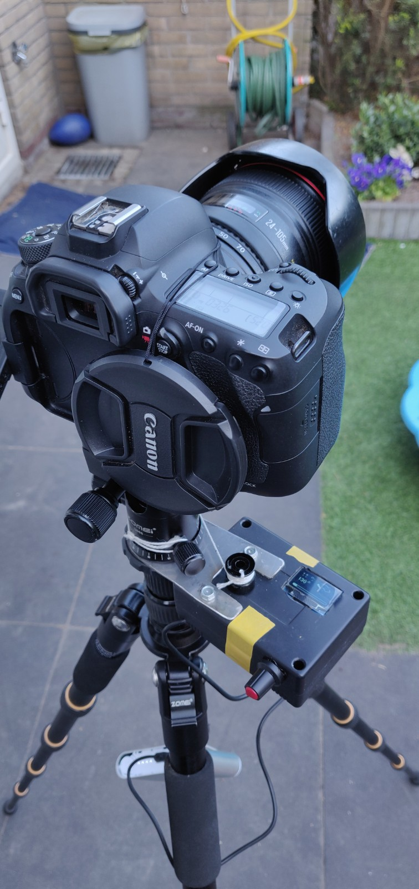
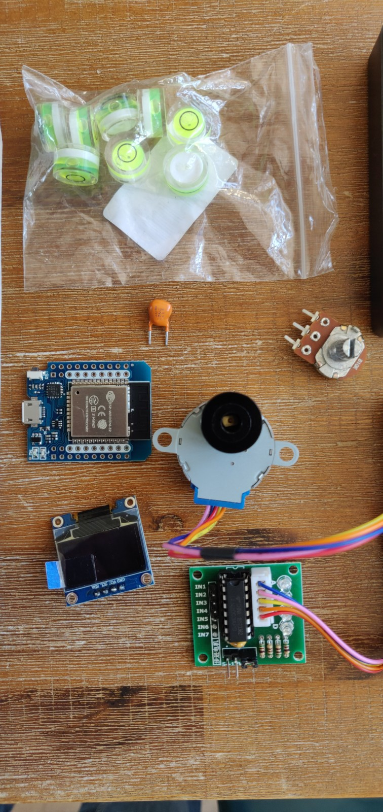

# WiFiTimelapse
WiFi controlled timelapse using ESP32 and a stepper motor

Many cheap timelapse rotators can only handle action cams or cell phones and not DSLR's, let alone heavy off center weight fullframe camera's.
A timelapse rotator for such a camera will be expensive, the cheapest I found is the [Syrp Genie Mini](https://syrp.co/us-en/genie-mini-ii-sy0033-0001)
These devices are pretty expensive though. I therefore wanted to build something myself which is cheap, lightweight and full-feature and without doing the mechanics of making a stable rotating platform. 

I bought an Arduino starter kit with all kind of gimmicks some time ago and that included a stepper motor, so I decided to start playing with that. It worked like a charm with little effort. If only I could operate it remotely... Wait a minute, I also have some ESP32 demo boards lying around here somewhere ! This is how the project got born. 

My timelapse device relies on the mechanics of the tripod for steady rotation and an external 5V (USB) power source. I need to spin the wire around the tripod head 360° before the timelapse can begin. I can do this clockwise or anti-clockwise, whatever timelapse rotation direction I desire.
The tripod screw for rotating needs to be unlocked and of course the tripod must be level to make sure not to overload the stepper motor. There was no irreversable modification to my tripod. Mounting and unmounting the device can be done in less than a minute. 
Total material cost was around €25 excl. the USB powerbank to power it and a small stainless steel plate that I already had lying around. 

I ordered parts from China and developed the software in the meantime before all the parts arrive. As my camera has a completely built-in timelapse movie functionality, including timer, I don;t need to externally trigger it. When this is required, there are sufficient pins on the ESP32 left to do that still. Maybe I will extend it for long exposure timelapses such that there is no motor movement during the exposure. The current implementation will continuously rotate the motor with the ability to fade-in and out (accellerate / decellerate), thanks to de TinyStepper library I used.

I also fitted a small 0.96" OLED screen via the I2C interface, sufficient space for 3 rows of readable text and / or graphics. It features all setup screens and 4 status screens showing the rotation progress, time progress, number of pictures taken and total timelapse video length at the chosen framerate.
Besides the Wifi / webpage setup, I wanted also to be able to setup the timelapse manually without the use of the phone, by using a potentiometer. Three parameters can be setup like that: degrees, duration, accelleration (time). Left-most position for 10 seconds is to traverse back one screen, keeping the potentiometer at the same setting for 5 seconds or more ill commit the setting and traverse to the next setup screen. When all is setup, the potentiometer has 3 settings: left = back, mid is wait for camera has been setup and right to start the timelapse.

Components I used:
1x Wemos ESP32 D1 mini WROOM processor board (built-in Wifi & Bluetooth)
1x 28BYJ-48 stepper motor, 5V version
1x ULN2003 stepper motor driver board
1x 0.96" I2C OLED display
1x 16 teeth pulley (3d printer gear)
1x 10k potentiometer for manual setup + knob
1x plastic case 90x65x36mm
1x stainless steel mounting plate (custom made by hand)
1x USB cable
1x USB powerbank (mine has 4x 18650 Li-ION cells, could do with less I guess)
1x non elastic rope, enough to circle round the tripos and hook it up to the lowest knob of the tripod head, to the pulley
Connecting wires

This has been a great project to do and I learnt a lot about the ESP32, Arduino IDE, HTML5, I2C OLED displays and stepper motors.
Before you start doing something similar, make sure you have basic understanding about Arduino like devices and some soldering skills. Know you can pull this off before you order any parts, maybe with some help from a friend nearby. If you lack the skills, save a little more money and buy a device like the Syrp Genie Mini (which I don't have by the way).

Examples: [here](https://www.youtube.com/watch?v=nGwtubR2ZZ4) and [here](https://www.youtube.com/watch?v=42JMQuwSPBg)
